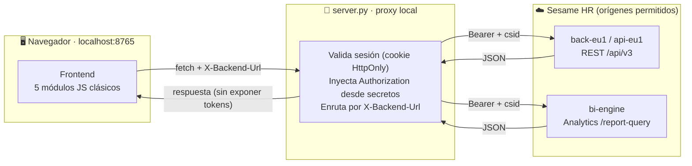
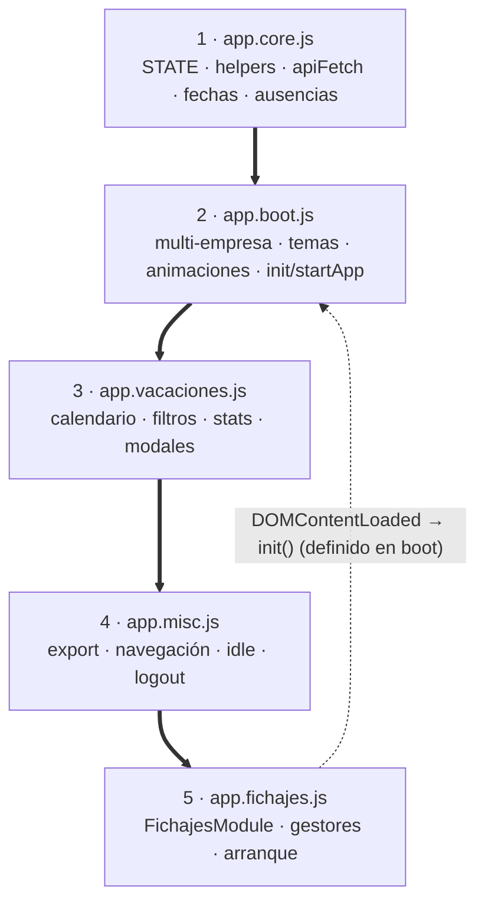

# 🏗️ Arquitectura Técnica Exhaustiva - Sesame Premium Dashboard

Este documento sirve como el manual de ingeniería definitivo para el **Sesame Premium Dashboard**. Detalla los patrones de diseño, las decisiones arquitectónicas, los algoritmos de procesamiento de datos y las estrategias de resiliencia implementadas para construir una capa analítica avanzada sobre la infraestructura de Sesame HR.

---

## 1. Topología del Sistema y Estrategia de Red

El sistema opera en una arquitectura híbrida cliente-servidor local diseñada para compatibilizar la ejecución en navegador con las APIs de Sesame HR, evitando exponer credenciales en el código cliente.

**Diagrama de flujo de datos:**



### 1.1. El Proxy Híbrido (`server.py`)
Dado que las APIs de Sesame imponen políticas estrictas de CORS (Cross-Origin Resource Sharing) que impiden a un navegador hacer peticiones directas desde `localhost` o dominios no autorizados, el proyecto incluye un micro-servidor proxy escrito en Python puro (sin dependencias externas pesadas).
- **Inyección controlada de cabeceras**: Intercepta las peticiones del frontend y añade únicamente las cabeceras necesarias para compatibilidad con la API de Sesame.
- **Enrutamiento Dinámico**: Utiliza la cabecera personalizada `X-Backend-Url` enviada por el frontend para saber si debe enrutar la petición hacia `api-eu1`, `back-eu1` o `bi-engine`.
- **Gestión de secretos**: Lee `config.json` (público) y `config.secrets.json` (privado), fusionándolos en memoria solo en el servidor. El endpoint `/config` entrega metadatos sin tokens ni contraseñas; el proxy inyecta `Authorization` desde el almacén local de secretos.
- **Límite de exposición**: `server.py` puede escuchar en `127.0.0.1` o en `0.0.0.0`. El lanzador `start.sh` arranca en modo LAN por defecto para facilitar uso interno, mientras `bash start.sh local` limita el acceso al equipo actual. En ambos casos se bloquean rutas sensibles como `config.secrets.json`, claves TLS, claves de cifrado y carpetas internas.
- **Sesión local de desbloqueo**: La pantalla de contraseña ya no es solo una barrera visual. Cuando `/validate-password` valida la clave maestra, el servidor emite una cookie `HttpOnly` y de corta duración; el proxy exige esa sesión antes de inyectar tokens guardados o aceptar mutaciones de configuración. La conexión inicial con un token recién pegado puede seguir validando `/me` sin sesión porque todavía no usa secretos guardados.

### 1.2. Origen del Token y Naturaleza de la Integración

La integración no se basa en un API token público generado desde un panel administrativo de Sesame. El proyecto reutiliza la sesión web autenticada del usuario, concretamente:

- `Authorization: Bearer ...`
- `csid` de empresa

El asistente `get-token.py` levanta un receptor local en `http://localhost:8766/receive` y facilita una captura controlada de las cabeceras que la propia aplicación web de Sesame envía al interactuar con `app.sesametime.com`. Una vez capturadas, las credenciales se guardan en `config.secrets.json`; si `cryptography` está disponible, `server.py` las cifra en reposo mediante Fernet.

Implicación técnica: desde el punto de vista del código, el dashboard consume endpoints web/internos `/api/v3` protegidos por la sesión del usuario. No hay llamadas a un endpoint de creación de tokens, OAuth client credentials, API keys públicas ni panel de generación de API tokens. Si Sesame clasifica estos endpoints como API privada/no documentada, esa clasificación pertenece a Sesame; el comportamiento observable es el de una sesión web con `Bearer` y `csid`.

Los límites de uso autorizado, privacidad y cumplimiento están documentados en `COMPLIANCE.md`. Si Sesame no autoriza este mecanismo o exige API oficial, la integración debe migrarse antes de usar datos reales en producción.

### 1.3. Dominios y Superficie de APIs

El proxy limita los destinos remotos permitidos a tres orígenes:

| Dominio | Uso |
|---------|-----|
| `https://back-eu1.sesametime.com` | Backend principal para endpoints REST `/api/v3` |
| `https://api-eu1.sesametime.com` | Backend alternativo para failover/domain flipping |
| `https://bi-engine.sesametime.com` | Motor BI para `/api/v3/analytics/report-query` |

Inventario funcional de endpoints usados por la aplicación:

| Área | Endpoints |
|------|-----------|
| Sesión | `/api/v3/security/me` |
| Empleados | `/api/v3/employees`, `/api/v3/companies/{companyId}/employees`, `/api/v3/employees/{employeeId}` |
| Tipos de ausencia | `/api/v3/companies/{companyId}/absence-types` |
| Calendario | `/api/v3/companies/{companyId}/calendars-grouped`, `/api/v3/companies/{companyId}/calendars`, `/api/v3/employees/{employeeId}/calendars` |
| Saldos de vacaciones | `/api/v3/vacation-configuration/employee/{id}`, `/api/v3/statistics/employee/{id}/vacations` |
| Presencia | `/api/v3/statistics/presence`, `/api/v3/presence-status`, `/api/v3/employees/presence`, `/api/v3/presence`, `/api/v3/attendance/presence`, `/api/v3/work-entries/presence`, `/api/v3/companies/{companyId}/employees/presence` |
| Fichajes | `/api/v3/employees/{employeeId}/checks`, `/api/v3/work-entries/search`, `/api/v3/checks/search`, `/api/v3/work-entries`, `/api/v3/checks`, `/api/v3/attendance`, `/api/v3/timesheets`, `/api/v3/statistics/daily-computed-hour-stats` |
| Incidencias | `/api/v3/check-incidences` |
| BI Analytics | `/api/v3/analytics/report-query` |

### 1.4. Resiliencia y Domain Flipping (Failover)
La función `apiFetch` (definida en `app.core.js`) es el núcleo de la comunicación. Implementa una heurística de recuperación de errores:
1. **Intento Primario**: Lanza la petición al subdominio configurado (ej. `back-eu1.sesametime.com`).
2. **Detección de Caídas**: Si recibe un error `502`, `503`, o un fallo de red (`TypeError: Failed to fetch`), activa el modo de reintento.
3. **Domain Flipping**: Cambia dinámicamente el objetivo de `back-eu1` a `api-eu1` (o viceversa) e inyecta la nueva ruta en `X-Backend-Url`. Esto ha demostrado saltar mantenimientos puntuales o bloqueos zonales en la infraestructura de Sesame.

---

## 2. Motor de Procesamiento y Normalización de Datos

El mayor desafío técnico del proyecto es la inconsistencia estructural de las distintas APIs de Sesame. El pipeline de datos está diseñado para ingerir, limpiar y unificar esta información.

### 2.1. Ingesta Multi-Fuente Concurrente
Para construir el panel de Fichajes, no basta con un solo endpoint. El método `loadData()` orquesta un `Promise.allSettled` que dispara peticiones simultáneas a:
- **BI Analytics Engine** (`/api/v3/analytics/report-query`): Extrae la "verdad histórica", incluyendo coordenadas GPS, IPs y nombres de dispositivos.
- **Incidencias REST** (`/api/v3/check-incidences`): Extrae modificaciones de jornada realizadas a posteriori por los empleados.
- **Solicitudes REST** (`/api/v3/work-entry-requests` & `/api/v3/requests`): Extrae peticiones genéricas o borrados pendientes de aprobación.

### 2.2. Incidence Detection Engine (v1.4.0)
El BI Engine de Sesame tiene un desfase (eventual consistency) y no refleja inmediatamente las solicitudes de borrado o edición pendientes de aprobación por RRHH.
- **El Algoritmo**: El dashboard descarga las tablas de solicitudes crudas y realiza un *Fuzzy Match* (búsqueda aproximada) contra los registros del BI, comparando IDs de empleado, fechas y fragmentos de hora (`HH:MM`).
- **Resolución**: Si un registro de BI coincide con una solicitud de borrado/edición pendiente en la REST API, el motor muta el registro, le inyecta un flag de `pendingDeletion` o `pendingEdit`, lo renderiza con opacidad reducida (`⏳ PENDIENTE`) y, críticamente, **lo excluye del cálculo total de horas trabajadas en el día**.

### 2.3. Smart Match (Cruce Ausencias vs Fichajes)
La función `parseRealSignings` es el corazón analítico.
- Recibe la amalgama de datos de BI y las ausencias (Vacaciones, Bajas) del módulo de calendario.
- Agrupa los registros por la clave compuesta `EmpleadoID_Fecha`.
- **Cruce Geométrico Temporal**: Detecta si en un día marcado como "Vacaciones", el empleado tiene registros de tipo "Trabajo". En lugar de ocultar la anomalía, la UI grafica la barra de vacaciones de fondo y superpone el fichaje real, evidenciando un posible error administrativo o trabajo en festivo.

### 2.4. Normalización Universal (`upsertEmployee`)
El objeto "Empleado" difiere drásticamente si viene del endpoint `/me`, de `/employees`, o del `BI Engine`.
- `upsertEmployee` actúa como un *Reducer* global. Acepta cualquier fragmento JSON que represente a un empleado y hace un *merge* (fusión) con los datos existentes en memoria (`STATE.allEmployees`).
- **Extracción Recursiva**: Busca la fecha de nacimiento en `emp.birthDate`, `emp.birthday`, `emp.personalData.birthDate`, etc. Salva fotos de perfil perdidas conservando la URL original si la nueva petición la omite.
- **Horario y Plantilla Pactada**: Extrae la matriz semanal de trabajo (`workdays`, mapa de segundos diarios `0..6`) y almacena el nombre del calendario o plantilla de turno asignada (`scheduleTemplateName`) para contrastar fichajes reales con horas teóricas oficiales.

---

## 3. Deep Birthday & Profile Harvest (Descubrimiento en Profundidad)

Dado que la lista general de empleados de Sesame censura las fechas de nacimiento por privacidad por defecto y omite información detallada de turnos, el sistema implementa una táctica de extracción en dos fases para popular el panel de cumpleaños y la jornada pactada de cada empleado:

1. **Nivel 1 (BI Query)**: Intenta inyectar una consulta al motor de Analytics solicitando el campo `core_context_employee.birthDate`. Si el WAF (Web Application Firewall) lo permite, extrae el 100% de las fechas en una sola llamada de 200ms.
2. **Nivel 2 (Serial Profiling Fallback)**: Si el BI no devuelve datos o faltan datos de turnos/horarios (`workdays`), el dashboard inicia una rutina en background (`startSerialProfileScan`) sobre perfiles accesibles por la cuenta autenticada (hasta 50 candidatos concurrentes por lote). Esta capacidad permite sincronizar de manera no bloqueante los cumpleaños y turnos semanales; la interfaz se actualiza progresivamente con una barra de progreso sutil.

---

## 4. BI Schema Discovery & Auto-Tuning

Diferentes cuentas de empresa en Sesame tienen diferentes niveles de licenciamiento (Premium vs Basic), lo que activa o desactiva campos en el BI Engine (ej. Geolocation).
- **Probing Inicial**: Al conectar una empresa, el dashboard lanza una *query sonda* pidiendo todos los campos de auditoría posibles (Latitud, Longitud, IP, Device Name).
- **Filtro Adaptativo**: Si la API devuelve un error `400 Bad Request` indicando que un campo (ej. `check_in_latitude`) "no existe", el algoritmo captura la excepción, purga ese campo de su esquema interno y reintenta.
- **Caché de Esquema**: El esquema final "válido" se guarda en `localStorage` bajo `ssm_bi_schema_{companyId}`, garantizando que las consultas futuras sean ultrarrápidas y 100% exitosas.

---

## 5. Gestión de Estado y Persistencia (UX Memory)

La aplicación implementa un patrón similar a Redux pero en Vanilla JS puro, gestionando todo en un único objeto `STATE`. Para ofrecer una experiencia de usuario fluida sin fricciones, implementa memoria a largo y corto plazo:

- **Local Storage (Memoria Larga)**:
  - `theme`: Modo Claro u Oscuro.
  - `ssm_current_module`: El último módulo abierto (Fichajes o Vacaciones), asegurando que un F5 no te expulse de tu flujo de trabajo.
  - `ssm_sidebar_collapsed`: Estado de contracción del menú lateral.
  - Estados de colapso individuales de sub-secciones del menú.
  - Identificador de empresa activa y endpoint backend. Los tokens no se persisten en `localStorage` cuando se usa el proxy local.
- **Session Storage (Memoria Corta)**:
  - `ssm_current_date`: La fecha o periodo temporal que el usuario estaba analizando.
  - `ssm_unlocked`: Estado visual de desbloqueo para la sesión actual del navegador. La autorización real de proxy se valida en servidor mediante cookie `HttpOnly`.
  - `ssm_fichajes_cache`: Caché efímera de grandes bloques de datos JSON para que navegar atrás/adelante sea instantáneo.

---

## 6. Arquitectura Visual y Diseño (CSS Stack)

El frontend no utiliza librerías (Cero React, Vue o Tailwind) para garantizar un tamaño de *bundle* de 0 KB y tiempos de ejecución sub-milisegundo.

- **Variables CSS Dinámicas**: Todo el esquema de color está tokenizado en la raíz (`:root`). El cambio de tema invierte las variables fundamentales (`--bg-base`, `--text-primary`), haciendo que la transición sea manejada íntegramente por el motor de renderizado de la GPU del navegador.
- **Glassmorphism & Jerarquía**: Uso intensivo de `backdrop-filter: blur()`, fondos translúcidos (`rgba(255,255,255,0.03)`) y bordes de contraste (`1px solid var(--border)`) para crear profundidad.
- **Capa Visual Premium (v1.5.0)**: `styles.css` añade una capa final de superficies elevadas, bordes fuertes, sombras suaves, estados hover/focus consistentes, selector de empresa activo estable y responsive reforzado sin cambiar la estructura HTML/JS.
- **Bento-Grid Details**: El panel de detalles expandible de un fichaje usa un layout tipo "Bento Box" (cajas asimétricas organizadas en un grid perfecto) para mostrar métricas heterogéneas (Mapa GPS, Tiempos, Dispositivos) de forma digerible.
- **Timeline de Fichajes**: Las barras de trabajo, pausa y ausencias se renderizan como segmentos rectos sobre una línea temporal. No se redondean para preservar la lectura de escala y evitar un aspecto de píldoras independientes.
- **Kiosko Mode**: Un flag en el estado que aplica clases CSS a nivel del `<body>` para ocultar la barra lateral y controles, maximizando el área gráfica para pantallas de televisión en salas de reuniones.

---

## 7. Motor de Ausencias Parciales (v1.6.0)

### Problema resuelto
El API de calendarios de Sesame tiene dos endpoints con diferente granularidad:
- `/calendars-grouped` — devuelve ausencias agrupadas por tipo/día, sin horario exacto.
- `/calendars` — devuelve ausencias individuales por empleado con `startTime`/`endTime` cuando son de jornada parcial.

El módulo de Fichajes usaba únicamente los datos de presencia (`/workEntries`) para renderizar la línea de tiempo, por lo que los tramos de ausencia parcial (p. ej., visita médica de 10:16 a 12:02) eran invisibles en el detalle de ese día.

### Solución implementada

#### `fetchAbsenceTimesIndex(from, to)`
Función global no bloqueante que consulta `/calendars` y construye `STATE.absenceTimesIndex`, un `Map` con clave `"empId_date"` y valor `{startTime, endTime, seconds}`. Se llama tras cargar el calendario y el resultado queda disponible para toda la interfaz.

#### `FichajesModule.absenceTimesMap`
Mapa análogo construido dentro de `FichajesModule.loadData` usando `fetchCalendarsRaw()`. Se almacena en la instancia del módulo y se cruza en `parseRealSignings` para inyectar los horarios exactos en los `absenceSegments` de cada fila.

#### Renderizado en la UI
Las ausencias parciales se visualizan en tres capas:

| Capa | Elemento | Descripción |
|------|----------|-------------|
| **Modal calendario** | Badge `🕐 HH:MM – HH:MM` | Se muestra bajo el nombre del empleado en el modal de día del calendario de vacaciones. |
| **Mini-línea de actividad** | Barra violeta `rgba(139,92,246,0.35)` | Renderizada por `_absTimelineHtml()` sobre el contenedor `detail-activity-timeline` (24 px). |
| **Tabla de detalles** | Fila `📌 <Tipo>` con horario y duración | Generada por `_absTableRowsHtml()`. Se omite si un fichaje físico ya cubre ese tramo horario exacto (lógica de solapamiento por minuto). |

#### Lógica de deduplicación
Para evitar duplicados entre el registro del calendario y los fichajes físicos (que a veces también se etiquetan con el tipo de ausencia), `_absTableRowsHtml` aplica una comprobación de solapamiento temporal:
```
ausencia visible ⟺ no existe ninguna entrada (type ≠ 'work'/'pause')
                    cuyo tramo [eIn, eOut] solape con [absStart, absEnd]
```
Esto garantiza que el tramo 10:16-12:02 aparezca como fila `📌` si no hay ningún fichaje que lo cubra, pero se suprima si ya hay un `🚪` registrado para ese periodo exacto.

---

## 8. Motor de Balance Horario

La vista **Fichajes > Balances** combina fuentes oficiales, datos históricos de fichajes y calendario para calcular el saldo horario por empleado con trazabilidad visible.

### 8.1. Orden de prioridad de datos

El diseño evita depender de una única API no garantizada:

1. **Sesame Statistics oficial**: `GET /schedule/v1/reports/worked-hours`.
   - Parámetros esperados: `from`, `to`, `employeeIds[in]`, `limit`, `page` y, si Sesame lo admite, `withChecks`.
   - Campos esperados: `employeeId`, `secondsWorked`, `secondsToWork`, `secondsBalance`.
   - Si hay fila oficial para el empleado/periodo, se usa `secondsBalance` como fuente principal y se marca como `Sesame Statistics`.
2. **Cálculo local**: fallback cuando el endpoint oficial no devuelve datos, devuelve 403/404, no está habilitado para la sesión o no incluye `secondsBalance`.
3. **Diagnóstico**: rutas como `hours-bag-overtime` o variantes privadas quedan solo para auditoría técnica. Si Sesame responde `403 Forbidden Access Permission`, no se usan como fuente productiva.

El modal de Balance muestra siempre la fuente usada para evitar ambigüedad entre dato oficial y dato calculado.

### 8.2. Cálculo local

El cálculo local parte de las filas normalizadas por `parseRealSignings`:

- `workedSeconds`: segundos reales de trabajo, excluyendo pausas.
- `totalPauseSec`: suma de pausas.
- `theoreticSeconds`: jornada teórica final del día.
- `balanceSec`: `workedSeconds - theoreticSeconds`.
- `compensatedSeconds`: permisos retribuidos detectados en calendario.
- `compensatedAppliedToTheoretic`: parte del permiso retribuido que reduce la jornada a cubrir.

La regla importante es que las ausencias retribuidas por horas **no se suman como trabajo real**. Se muestran como **ajuste de jornada**: reducen la jornada teórica pendiente cuando Sesame no proporciona ya una jornada calculada por BI. Esto evita inflar el tiempo trabajado y permite cuadrar con el portal de Sesame.

### 8.3. Jornada teórica

La jornada teórica diaria se resuelve por prioridad:

1. `biTheoreticMap`: dato calculado por Sesame BI cuando existe.
2. `dayOverrides`: calendario individual, ausencias de día completo o excepciones.
3. Plantilla semanal del empleado.
4. Fallback conservador de 8h.

Después se aplican reglas de empresa:

- **Víspera de festivo/día no laborable**: si el día siguiente laborable está marcado como festivo, no laborable o ausencia de día completo aplicable, la jornada puede limitarse a 7h.
- **Permiso retribuido parcial**: si Sesame BI no dio ya una jornada final, la duración retribuida reduce la jornada teórica a cubrir.
- **Gestión Privada**: se muestra como ausencia/nota visual, pero no se trata automáticamente como permiso retribuido salvo que Sesame lo marque así en los datos de calendario.

### 8.4. Ausencias, vacaciones y puentes

Los contadores del modal separan conceptos:

- **Ausencias**: permisos, gestión privada, médico, bajas u otros tipos personales.
- **Vacaciones**: tipos de calendario asignados al empleado como vacaciones, incluyendo puentes si la empresa los registra así en Sesame.
- **Calendario de empresa/festivos**: no cuentan como ausencia personal ni como vacaciones del empleado.

Para esto se cruzan dos fuentes:

- `/calendars-grouped`: útil para saber qué empleados tienen eventos en cada día.
- `/calendars`: más preciso para tipo real, días `daysOff`, horarios parciales y metadatos de ausencia.

El motor deduplica por empleado, fecha y tipo para no contar dos veces el mismo evento si aparece en ambas fuentes.

### 8.5. Rango efectivo del balance anual

En el botón **Balance**, la carga puede consultar el ejercicio completo para preparar el contexto anual. Sin embargo, las métricas equivalentes al portal de Sesame se acotan al rango efectivo mostrado.

Ejemplo: si el ejercicio consultado es `2026-01-01 - 2026-12-31`, pero hoy es `2026-06-06`, el modal muestra y calcula los indicadores de resumen contra `2026-01-01 - 2026-06-06`. Esto evita contar vacaciones futuras o ausencias posteriores a la fecha de comparación.

### 8.6. Métricas del modal de empleado

El modal de Balance muestra:

- Balance usado.
- Trabajado.
- Teórico.
- Ajuste jornada.
- Pausas.
- Entrada media.
- Salida media.
- Jornada media.
- Días trabajados / días teóricos.
- Descansos y promedio de descanso.
- Ausencias y vacaciones.
- Comparativa entre local, bolsa y Sesame Statistics.
- Detalle de ajustes retribuidos.
- Jornadas desplegables con fichajes diarios.

Las medias de entrada/salida se calculan desde timestamps originales cuando existen; si no, se usa la hora normalizada visible.

### 8.7. Carga visual y limpieza de progreso

La vista **Balances** tiene identidad de carga propia y no depende de la barra superior genérica de Fichajes:

- `renderBalanceWarmup()` muestra un estado inicial inmediato con rango, empleados candidatos y skeletons.
- `prepareOfficialWorkedHoursLoad()` inicializa el progreso local con fase `local` antes de consultar Sesame Statistics.
- `startBalanceLocalPulse()` anima el avance local mientras se prepara la base de datos calculada, incluso si todavía no hay progreso real del endpoint remoto.
- `startOfficialWorkedHoursLoad()` cambia de fase a `statistics` y después a `history` para separar la consulta oficial de Sesame y la aplicación de bolsa de horas.
- `resetSigningsTopProgress()` fuerza la barra superior genérica a `hidden` y `0%` al entrar o terminar Balance, evitando que quede visible al 100% por estados heredados de cargas anteriores.

Este diseño evita dos problemas de UX: sensación de bloqueo al entrar en Balance y barras de progreso residuales cuando el cálculo ya terminó.

### 8.8. Plantillas de Jornada Pactada e Integración Híbrida
Para comparar el tiempo de trabajo efectivo no sólo con la jornada teórica de un día concreto sino con el turno formal de contrato del trabajador, el dashboard realiza un cruce híbrido:
- **Carga lazy optimizada (`ensureProfilesLoaded`)**: Antes de calcular saldos o balances en el periodo, se auditan las IDs de los empleados involucrados. Aquellos cuyos perfiles locales no tengan la jornada semanal (`workdays`) cargada son consultados en lotes pequeños (máximo 5 peticiones concurrentes) para no disparar alertas del limitador WAF de Sesame.
- **Inyección de Metadatos de Horario**: Cada ficha diaria de control horario y balance almacena e inyecta dinámicamente un badge de jornada pactada `⏱ JORNADA PACTADA` con la duración correspondiente según el día de la semana y el nombre descriptivo de la plantilla activa de Sesame (ej. *Jornada 40h/semana Turno 13:00h - ZGZ*).
- **Evitación de Solapamientos**: El indicador de jornada pactada en el menú desplegable del balance por día se renderiza en un contenedor flex aislado con diseño de píldora de alto contraste. Esto evita solaparse con las métricas cuantitativas principales (Trabajado, Teórico, Pausas), manteniendo una legibilidad perfecta del grid.

---

## 9. Vista Empleados de Vacaciones

La subvista **Vacaciones > Empleados** resume las ausencias agrupadas por empleado y tipo, pero conserva la granularidad diaria necesaria para auditar permisos parciales.

### 9.1. Modelo de datos agregado

`renderEmployeeList()` construye un mapa por empleado y tipo de ausencia con:

- `dates`: días visibles del mes.
- `dateKeys`: fechas completas `YYYY-MM-DD`, usadas para calcular día de semana y mes.
- `fullDates`: ausencias de día completo.
- `partialDates`: ausencias parciales.
- `partialSeconds`: duración acumulada de permisos parciales.
- `partialSlots`: lista de tramos `{date, day, startTime, endTime, seconds}`.

El índice `STATE.absenceTimesIndex` se consulta por clave `empId_date` para asociar cada ausencia parcial con su horario real. Cuando ese índice termina de cargar en segundo plano, se llama a `refreshAllViews()` para repintar la vista con los horarios exactos sin bloquear la primera carga.

### 9.2. Lectura visual de fechas

Para reducir ambigüedad, cada chip de día se formatea con `formatAbsenceDateMeta()`:

- Formato compacto visible: `Vie 05 Jun`.
- Detalle completo en tooltip: `05 de Junio - Viernes`.

En ausencias parciales, la fecha compacta se muestra junto a la franja horaria (`Vie 05 Jun · 12:00-14:00`). En ausencias completas, los días aparecen como chips separados debajo del tipo. Esto evita cadenas largas como `01 08:00-16:00, 02 08:00-16:00` donde era fácil perder qué horario pertenecía a cada día.

---

## 10. Gestor de Plantillas Locales y Overrides por Día (v1.7.4)

Sesame solo permite asignar plantillas de jornada por rango (con histórico oficial). Para soportar **periodos especiales** (jornada de verano, paternidad, etc.) sin contaminar Sesame, el dashboard introduce una capa **local** de overrides almacenada en `config.schedules.json` (gitignored).

### 10.1. Estructura del fichero

```json
{
  "<companyId>": {
    "customTemplates": [
      {
        "id": "local-xxxx",
        "name": "Jornada 35h flexible",
        "mondayMinutes": 420,
        "tuesdayMinutes": 420,
        "wednesdayMinutes": 420,
        "thursdayMinutes": 420,
        "fridayMinutes": 420,
        "saturdayMinutes": 0,
        "sundayMinutes": 0,
        "isLocal": true
      }
    ],
    "overrides": {
      "<employeeId>": {
        "<YYYY-MM-DD>": "<templateId>"
      }
    }
  }
}
```

### 10.2. Endpoints del proxy local

| Método | Ruta | Propósito |
|---|---|---|
| `GET`  | `/schedules` | Devuelve plantillas + overrides de todas las empresas. |
| `POST` | `/save-schedules` | Persiste overrides para un empleado (clave: empresa+empleado+fecha). |
| `POST` | `/save-custom-template` | Crea o actualiza una plantilla custom (deduplica por nombre case-insensitive). |
| `POST` | `/delete-custom-template` | Borra una plantilla y todos los overrides que la usaban. |

Todas las rutas protegidas por sesión maestra cuando hay contraseña configurada.

### 10.3. Jerarquía del teórico diario

`resolveEmployeeScheduleForDate(employee, dateKey)` consulta por prioridad:

1. **Override local** (`STATE.scheduleOverrides[companyId][empId][dateKey]`) → manda sobre todo.
2. **Sesame BI Engine** (`schedule_context_daily_computed.theoretic_seconds`).
3. **`dayOverride.workdayOverride`** (festivo de empresa o ausencia full-day).
4. **Plantilla vigente** del empleado por fecha (`scheduleTemplateAllViews` con `dateFrom`/`dateTo`).
5. **8h por defecto**.

Encima se aplican: víspera de festivo (si la empresa la sigue) y compensación por permisos retribuidos.

### 10.4. Auto-descubrimiento de plantillas

`discoverCompanyTemplates()` recorre `STATE.allEmployees` y agrupa por (nombre + minutos por día) las plantillas reales que Sesame asigna a cada empleado. Cachea sus minutos en `STATE.scheduleTemplateMinutes` para que el cálculo del teórico pueda resolverlas cuando se usen como override. El usuario puede importarlas como locales con un click desde el gestor de plantillas.

---

## 11. Capa de UX Premium (v1.7.5 / v1.7.6)

### 11.1. Sistema de toasts (`ssmToast`)

Sustituye `window.alert()` en todo el código. Cuatro variantes con icono y color, esquina inferior derecha, auto-cierre adaptativo (3s success/info, 6s error), pause-on-hover y botón de cierre manual. API: `ssmToast(msg, opts)` + helpers `toastOk` / `toastErr` / `toastWarn` / `toastInfo`.

### 11.2. Diálogo de confirmación propio (`ssmConfirm`)

Sustituye `window.confirm()`. Devuelve `Promise<boolean>`. Soporta Enter/Escape, focus automático, modo `danger:true` con botón rojo gradient para acciones destructivas.

### 11.3. Cache local de empleados

`STATE.allEmployees` se persiste en `localStorage` (`ssm_emp_cache_<companyId>`) con TTL de 1h. `loadInitialData` hidrata desde cache antes de hacer el fetch real; el fetch sigue corriendo en background y refresca la cache. Sensación de arranque instantáneo en sesiones consecutivas.

### 11.4. Breadcrumbs entre modales (`MODAL_STACK`)

Pila global de modales encadenados. Cuando se abre un modal secundario desde otro (ej. Balance → Gestionar calendario), aparece un breadcrumb sutil en el header con click para volver. Útil para no perder el flujo cuando se navega entre Balance, Gestor, Ficha y Plantillas.

### 11.5. Cierre unificado

Todos los modales registran su propio handler de `ESC` que cierra **solo el modal más reciente** (consulta el DOM para no cerrar uno oculto por `visibility: hidden`). Click fuera y botón `×` funcionan de forma uniforme.

## 12. Aislamiento Multi-Empresa, Animaciones y Navegación (v1.8.0)

### 12.1. Carga de empleados por empresa (anti-mezcla de plantillas)

Con un token de **administrador multi-empresa**, el directorio global `/api/v3/employees` puede ignorar la cabecera `x-company-id` y devolver empleados de **todas** las empresas del token, mezclando las plantillas en Fichajes y Balances. `fetchEmployees()` aplica una estrategia jerárquica:

1. **Fuente principal**: `/api/v3/companies/{companyId}/employees?include=personalData,details`. El `companyId` viaja en la URL, así que Sesame filtra en servidor y solo devuelve la plantilla de la empresa activa.
2. **Fallback filtrado**: si la fuente principal falla o devuelve ≤1 empleado, se consulta el directorio global y se filtra por `companyId` cuando el objeto lo expone (`getEmployeeCompanyId()` prueba `companyId`, `company_id`, `companyID`, `company.id`).
3. Cada empleado mapeado guarda su `companyId`, reforzando el guard `rowsBelongToAnotherCompany()`, que descarta lotes del BI Engine que pertenezcan a otra empresa.

Resultado: `STATE.allEmployees` queda aislado por empresa y nunca contamina el selector, los fichajes ni el balance.

### 12.2. Giro del icono de actualizar atado al ciclo de carga

El icono 🔄 de la barra superior refleja **cualquier** carga, no solo el clic manual:

- `setRefreshSpinning(btnId, on)`: helper con **duración mínima visible** (`REFRESH_SPIN_MIN_MS = 800`) que difiere la parada para que el giro sea perceptible aunque la carga termine al instante (caché) o el repintado sea lento por escritorio remoto. Si llega otra carga durante la parada diferida, cancela el timer y sigue girando.
- `FichajesModule.syncRefreshSpinner()`: sincronización **absoluta** (toggle según `this.isLoading || this.officialHoursBagLoading`), invocada al inicio/fin de `loadData` y en cada `renderBalanceTable`, de modo que el icono gira durante todo el *warmup* de balance en segundo plano y nunca se queda pegado.

Cubre refresco manual, auto-refresco silencioso cada 5 min y warmup de balance. Respeta `prefers-reduced-motion` (degrada a un cambio de color de acento estático).

### 12.3. Botón flotante "subir arriba"

`initScrollTopButton()` registra un único listener de `scroll` en **fase de captura** sobre `#app-screen` (el evento `scroll` no burbujea), filtrando por los contenedores scrollables principales (`.signings-table-container` de Fichajes/Balances y `.view` de Vacaciones). El botón `#scroll-top-btn` aparece al superar 400 px y devuelve el contenedor activo al inicio con scroll suave (instantáneo con `prefers-reduced-motion`). Vive a nivel de `<body>` con `position: fixed` y `z-index: 90`, por debajo de los modales (100) y del overlay de carga (9999), para no tapar diálogos.

### 12.4. Animaciones premium de acceso y carga

- `cardRise` (0.6s) + `cardChildIn` con *stagger*: entrada de las tarjetas de login y "Editar empresa" con leve overshoot y aparición escalonada de sus bloques.
- `loadingCardIn`: el panel del overlay "Conectando a Sesame" entra con escala al mostrarse; el pulso del logo usa `var(--accent)`.
- Toda la maquinaria respeta `@media (prefers-reduced-motion: reduce)`.

## 13. Estructura Modular del Frontend (v1.9.12)

Hasta la v1.9.11 todo el frontend vivía en un único `app.js` (~13.200 líneas). En v1.9.12 ese monolito se dividió en **cinco módulos**, sin cambiar ni una línea de lógica: la app se comporta de forma **idéntica**. La división mejora la navegación, el mantenimiento y el aislamiento entre áreas.

### 13.1. Modelo de carga (scripts clásicos, no ES modules)

Los cinco ficheros se cargan como `<script>` **clásicos** (no `type="module"`), por lo que **comparten un único scope global**: las `function`/`var` de nivel superior se exponen en `window` y los `const`/`let` viven en el *global lexical environment* compartido entre scripts clásicos. Se eligió este modelo en lugar de ES modules para **no romper los `onclick=` inline del HTML** (que invocan funciones globales por nombre) ni las ~500 referencias al objeto `STATE`. El resultado es semánticamente equivalente al monolito, verificable porque **la concatenación de los cinco ficheros en orden reproduce el `app.js` original byte a byte**.

### 13.2. Los cinco módulos y su orden de carga obligatorio

`index.html` los carga en este orden (y `server.py` los publica vía `PUBLIC_FILES`):

| # | Fichero | Responsabilidad |
|---|---------|-----------------|
| 1 | `app.core.js` | Cimientos: `STATE`, helpers de DOM (`$`/`$$`), saneado HTML, toasts/`ssmConfirm`, pila de modales, helpers de ausencias, `AUDIT`/`DISCOVERY`, **capa API** (`apiFetch`/`apiFetchBi`), API de horarios/plantillas, empleados y utilidades de fecha (`readSessionDate`). |
| 2 | `app.boot.js` | Config multi-empresa, temas, animaciones (cambio de empresa, telón de logout), arranque (`init`, `startApp`, `switchModule`) y carga de datos (`loadInitialData`, `loadData`). |
| 3 | `app.vacaciones.js` | Vista de Vacaciones: render de filtros, calendario, lista de empleados, estadísticas (Chart.js) y modales. |
| 4 | `app.misc.js` | Utilidades transversales: export CSV/JSON/iCal, navegación de periodos, `logout` y auto-cierre por inactividad (`startIdleWatch`). |
| 5 | `app.fichajes.js` | `FichajesModule` (motor de fichajes, balance y presencia), gestores de plantillas/calendario, y el arranque final `addEventListener('DOMContentLoaded', init)`. |

**Diagrama del orden de carga** (flecha gruesa = orden de carga; punteada = dependencia que se resuelve en `runtime`, tras `DOMContentLoaded`):



### 13.3. La regla de oro del orden

El hoisting de funciones **no cruza** entre scripts clásicos separados. Por eso el orden no es estético sino obligatorio:

- **`app.core.js` va primero** porque el inicializador de `STATE` (`currentDate: readSessionDate(...)`) y `setInterval(refreshLastUpdateLabels, …)` se ejecutan **en carga** y dependen de funciones definidas en core. Todo el código que se ejecuta al cargar core se resuelve dentro de core.
- **`app.fichajes.js` va último** porque contiene el `DOMContentLoaded → init` que enciende la app: cuando se dispara, los cuatro módulos anteriores ya están cargados. El inicializador eager de `const FichajesModule` solo usa `readSessionDate` (core) y builtins.
- **`app.boot.js`, `app.vacaciones.js` y `app.misc.js` no ejecutan nada en carga** (solo definen). Sus referencias a módulos posteriores (p. ej. `FichajesModule`) ocurren siempre dentro de cuerpos de función —y por tanto en *runtime*, tras `DOMContentLoaded`—, varias con guarda `typeof … !== 'undefined'`.

El grafo de dependencias se auditó por módulo: toda referencia tiene definición, las únicas dependencias *en carga* apuntan a módulos anteriores, y no hay identificadores de nivel superior duplicados (que provocarían *"Identifier already declared"* en el scope compartido).

### 13.4. Implicaciones de mantenimiento

- **Cache-busting**: cada `<script>` lleva su `?v=X.Y.Z`; al cambiar cualquier módulo hay que avanzar la versión (`APP_VERSION` en `app.core.js` y los `?v=` de `index.html`).
- **Alta en el servidor**: cualquier fichero JS nuevo debe añadirse a `PUBLIC_FILES` en `server.py` o el proxy responde 404.
- **CI**: `.github/workflows/ci.yml` valida la sintaxis (`node --check`) de los cinco módulos.

---
*Fin del Documento de Arquitectura (actualizado en v1.9.12).*
